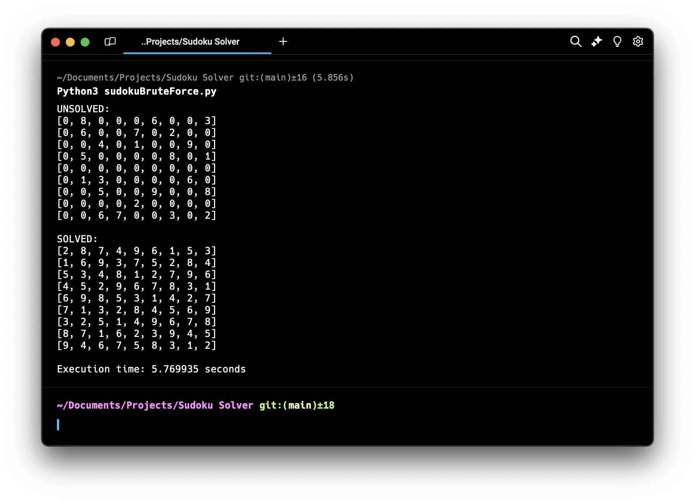

# Sudoku Solver :game_die:

These are all my attempts of creating a Python script that accepts user inputted boards as text files, solved them, and outputs to the console.

## Description

This program works as follows, I read in text files, and using both a custom class for sudoku boards and sudoku tiles, I populate my objects with a 2d array of tile objects.  I then start a depth-first search with backtracking, that will brute force the sudoku board, looking at every empty space, and starting top left to bottom right, trying all possible combinations.  I try this, checking the boards validity every new symbol, and once I reach a dead end, we backtrack.  This solution is simple in implementation, but resource intensive, the more zeroes are on the board the longer it will take, especially towards the front since attempts can go for a while before having the backtrack to the start.  
Previous versions of this program instead looked at the board through a lens closer to that of a real person, analyzing patterns and looking for giveaway cells before marking them.



## Features

* Will solve and display solution to any sudoku board via brute force.
* Accepts text files as sudoku board inputs, periods for unmarked squares, numbers for marked ones.
* Shows time taken to solve any board, as well as before and after solving for reference.

## Getting Started

### Dependencies
* Python3


### Installing

* Make sure that directory script is run from has your input boards.

### Executing program

* Currently run with no command line arguments.
```
Python3 sudokuBruteForce.py
```

## Future Plans

* There are two major things I would like to change in the future:
    1) I would like to combine both previous and latest versions into one program that first analyzes the board to see what can immediatly be done to it, then brute forces the rest.
    2) I would also like to make it more user friendly, adding a simple input menu system allowing for boards to be chosen or even custom entered would be nice.

## Authors

:key: ListenToAJ


## Version History

* 0.1
    * Initial version, simply iterated through board and if a spot had only one option it was chosen.
* 0.2
    * Attempting to add some misguided depth-first-search methods, didn't work as intended
* 0.3
    * Algorithim gained a little bit of future-sight, now tiles could have possible squares, so if there was multiple options for a tile, but only one tile in row for example could be 3, then it was declared 3.
* 0.4
    * MAJOR overhaul, complete depth-first-search brute forcing, added functionality as methods to sudoku board object class.

## License

© 2024 Anthony Simao
All rights reserved.

## Acknowledgments

* [GeeksforGeeks](https://www.geeksforgeeks.org)